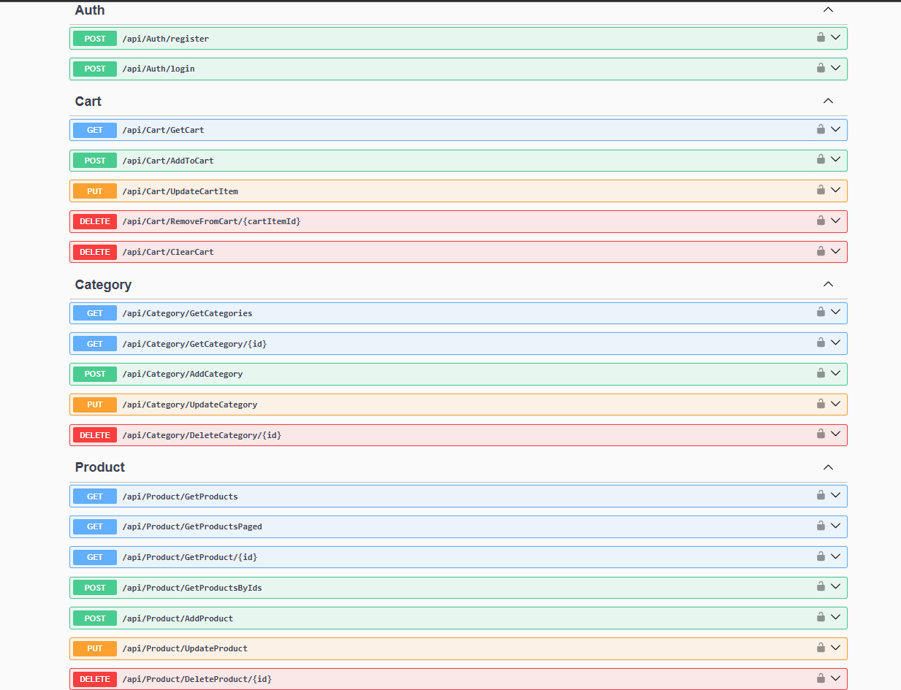
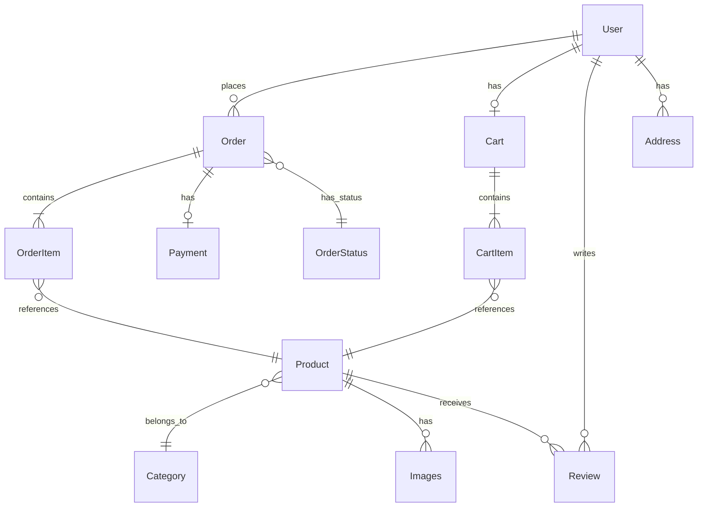

# 🛒 SmartEcommerce API

> A full-featured e-commerce REST API built with **.NET 8**, featuring **AI-powered visual product search** using CLIP embeddings, **JWT authentication**, and **cloud-based image management**.


---

## 📌 Overview

**SmartEcommerce API** is a comprehensive e-commerce backend that I built to consolidate my full knowledge stack into one production-grade project. It goes beyond traditional CRUD by integrating an **AI-powered image similarity search** — users can search for products using images, powered by OpenAI's CLIP model served via a companion FastAPI microservice.

The project follows a clean **3-tier architecture** (Presentation → Business Logic → Data Access) with a strong emphasis on separation of concerns, dependency injection, and scalable design patterns.

---

## 📸 API Preview



---

## ✨ Key Features

| Feature                    | Description                                                                               |
| -------------------------- | ----------------------------------------------------------------------------------------- |
| **🔍 AI Image Search**     | Visual product search using CLIP embeddings — find similar products by uploading an image |
| **🔐 JWT Authentication**  | Secure user registration & login with BCrypt password hashing and JWT bearer tokens       |
| **🛍️ Product Management**  | Full CRUD with pagination, multi-image support, and category organization                 |
| **🛒 Shopping Cart**       | Complete cart system — add, update, remove items with real-time stock awareness           |
| **📂 Category Management** | Hierarchical product categorization with full CRUD operations                             |
| **☁️ Cloud Image Storage** | Automatic image upload & management via Cloudinary CDN                                    |
| **📄 Swagger/OpenAPI**     | Interactive API documentation with JWT authentication support built-in                    |

---

## 🏗️ Architecture

```
SmartEcommerce (Solution)
│
├── SmartE_Commerce/                    # 🌐 Presentation Layer (Web API)
│   ├── Controllers/                    #     API endpoints
│   │   ├── AuthController.cs           #     Registration & Login
│   │   ├── ProductController.cs        #     Product CRUD + Image Search
│   │   ├── CategoryController.cs       #     Category CRUD
│   │   └── CartController.cs           #     Cart operations
│   └── Program.cs                      #     App configuration & middleware
│
├── SmartE_Commerce_Business/           # ⚙️ Business Logic Layer
│   ├── Contracts/                      #     Service interfaces
│   ├── DTOs/                           #     Data Transfer Objects
│   │   ├── Product/                    #     Create, Update, List, Details
│   │   ├── Category/                   #     Create, Update, List, Details
│   │   └── Cart/                       #     AddToCart, UpdateItem, CartDto
│   └── Services/
│       ├── AuthService.cs              #     JWT token generation & validation
│       ├── ProductService.cs           #     Product business rules
│       ├── CategoryService.cs          #     Category business rules
│       ├── CartService.cs              #     Cart business logic
│       ├── CloudinaryService.cs        #     Image upload to Cloudinary
│       └── EmbeddingService.cs         #     CLIP embedding via FastAPI
│
└── SmartE_Commerce_Data/               # 💾 Data Access Layer
    ├── Models/                         #     Entity models (14 entities)
    │   ├── User, UserRole, Address
    │   ├── Product, Category, Images
    │   ├── Cart, CartItem
    │   ├── Order, OrderItem, OrderStatus
    │   ├── Payment, Review
    │   └── ErrorViewModel
    ├── Repositories/                   #     Generic + specific repositories
    ├── Data/ECContext.cs               #     EF Core DbContext
    └── Migrations/                     #     Database migrations
```

---

## 🛠️ Tech Stack

| Layer               | Technology                                            |
| ------------------- | ----------------------------------------------------- |
| **Framework**       | ASP.NET Core 8.0 (Web API)                            |
| **Language**        | C# 12                                                 |
| **ORM**             | Entity Framework Core 8.0                             |
| **Database**        | SQL Server                                            |
| **Authentication**  | JWT Bearer Tokens + BCrypt                            |
| **Image Storage**   | Cloudinary CDN                                        |
| **AI / ML**         | OpenAI CLIP (via FastAPI microservice)                |
| **API Docs**        | Swagger / OpenAPI (Swashbuckle)                       |
| **Architecture**    | 3-Tier (Presentation → Business → Data)               |
| **Design Patterns** | Repository Pattern, Dependency Injection, DTO Pattern |

---

## 🚀 Getting Started

### Prerequisites

- [.NET 8 SDK](https://dotnet.microsoft.com/download/dotnet/8.0)
- [SQL Server](https://www.microsoft.com/en-us/sql-server) (LocalDB or full instance)
- [Cloudinary Account](https://cloudinary.com/) (free tier works)
- _(Optional)_ [FastAPI Image Search Service](https://github.com/Mohamed-EbrahimT/SmartEcommerce_FastAPI) for AI-powered visual search

### Installation

1. **Clone the repository**

    ```bash
    git clone https://github.com/Mohamed-EbrahimT/SmartEcommerceAPI.git
    cd SmartEcommerceAPI
    ```

2. **Configure the database** — Update `appsettings.json` with your SQL Server connection string:

    ```json
    {
        "ConnectionStrings": {
            "con": "Server=YOUR_SERVER;Database=SmartECommerceDB;Trusted_Connection=True;TrustServerCertificate=True"
        }
    }
    ```

3. **Configure Cloudinary & JWT** — Add your credentials to `appsettings.json`:

    ```json
    {
        "Cloudinary": {
            "CloudName": "your-cloud-name",
            "ApiKey": "your-api-key",
            "ApiSecret": "your-api-secret"
        },
        "JWT": {
            "SecretKey": "your-secret-key-min-32-chars",
            "Issuer": "SmartECommerce",
            "Audience": "SmartECommerceUsers"
        }
    }
    ```

4. **Apply database migrations**

    ```bash
    dotnet ef database update --project SmartE_Commerce_Data --startup-project SmartE_Commerce
    ```

5. **Run the application**

    ```bash
    dotnet run --project SmartE_Commerce
    ```

6. **Explore the API** — Navigate to `https://localhost:5001/swagger` for interactive documentation.

---

## 📡 API Endpoints

### 🔐 Authentication

| Method | Endpoint             | Description               |
| ------ | -------------------- | ------------------------- |
| `POST` | `/api/auth/register` | Register a new user       |
| `POST` | `/api/auth/login`    | Login & receive JWT token |

### 🛍️ Products

| Method   | Endpoint            | Description                  |
| -------- | ------------------- | ---------------------------- |
| `GET`    | `/api/product`      | List products (paginated)    |
| `GET`    | `/api/product/{id}` | Get product details          |
| `POST`   | `/api/product`      | Create product (with images) |
| `PUT`    | `/api/product/{id}` | Update product               |
| `DELETE` | `/api/product/{id}` | Delete product               |

### 📂 Categories

| Method   | Endpoint             | Description          |
| -------- | -------------------- | -------------------- |
| `GET`    | `/api/category`      | List all categories  |
| `GET`    | `/api/category/{id}` | Get category details |
| `POST`   | `/api/category`      | Create category      |
| `PUT`    | `/api/category/{id}` | Update category      |
| `DELETE` | `/api/category/{id}` | Delete category      |

### 🛒 Cart

| Method   | Endpoint                | Description           |
| -------- | ----------------------- | --------------------- |
| `GET`    | `/api/cart`             | Get user's cart       |
| `POST`   | `/api/cart/add`         | Add item to cart      |
| `PUT`    | `/api/cart/update`      | Update item quantity  |
| `DELETE` | `/api/cart/remove/{id}` | Remove item from cart |

---

## 🤖 AI-Powered Image Search

This project integrates with a **FastAPI microservice** that uses **OpenAI's CLIP model** to enable visual product search:

```
User uploads image → FastAPI generates CLIP embedding → Qdrant vector search → Returns similar products
```

The `.NET API` communicates with the FastAPI service through the `EmbeddingService`, which sends product image URLs for vectorization and storage. When a user searches by image, the system finds visually similar products using cosine similarity in the vector database.

👉 **[View the FastAPI Image Search Service Repository](https://github.com/Mohamed-EbrahimT/SmartEcommerce_FastAPI)**

---

## 📋 Database Schema

The application uses **14 entity models** covering the full e-commerce domain:



---

## 🧑‍💻 Author

**Mohamed Ebrahim**

- GitHub: [@Mohamed-EbrahimT](https://github.com/Mohamed-EbrahimT)

---
